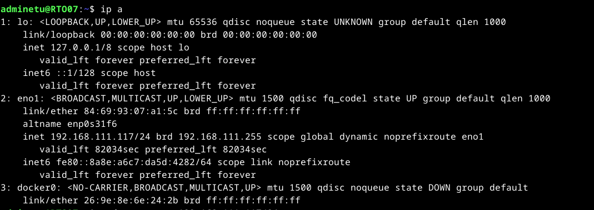
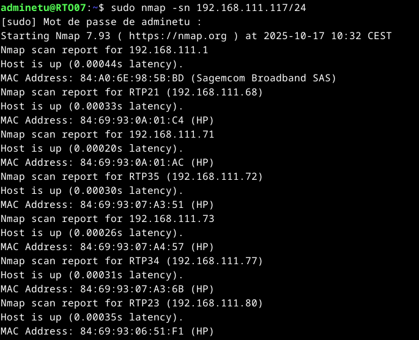
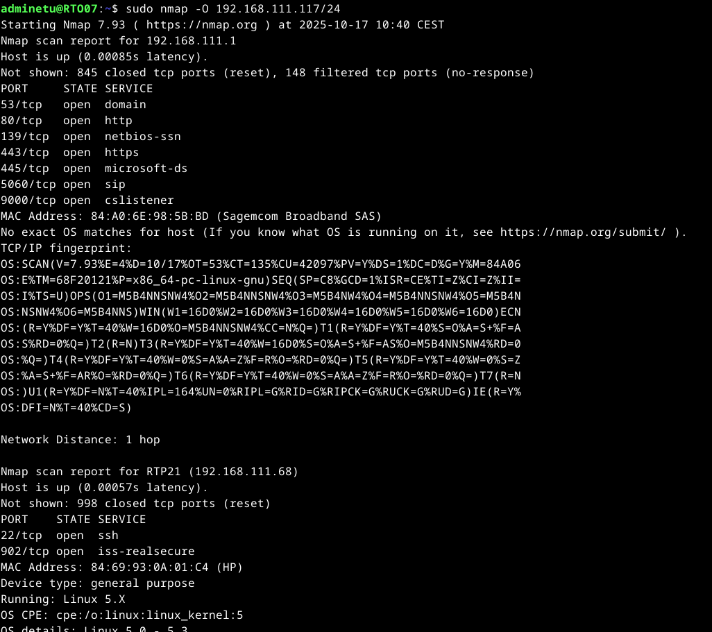
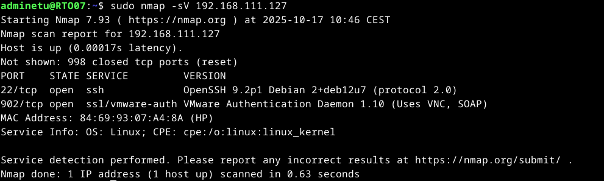
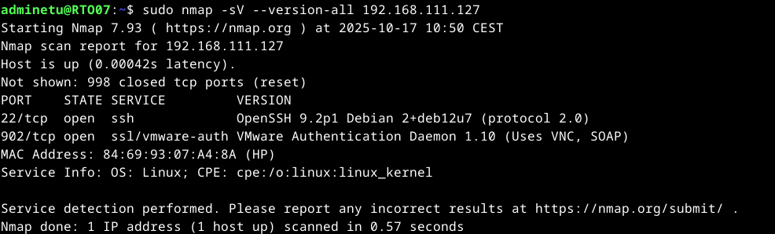

# Notice SAE


### Préparation 

- Se connecter à un réseau local 
- Prendre connaissance de votre adresse IP : 
    ```
    ip a
    ```
- Noter le masque de sous-réseau


### Découvrir les machines du réseau

- Ouvrir un terminal
- Installer `nmap` si ce n'est pas déjà fait :
  ```
  sudo apt install nmap
  ```
- Lancer une analyse du réseau :
  ```
  sudo nmap -sn <votre_adresse_ip>/<masque_de_sous_réseau>
  ```

Exemple :





### Découvrir les OS des machines du réseau (Fingerprint)

- Lancer une analyse du réseau (plus avancée):
  ```
  sudo nmap -O <votre_adresse_ip>/<masque_de_sous_réseau>
  ```

Exemple :



### Découvrir les services disponibles sur une machine distante

- Lancer une analyse des ports et services ouverts sur une machine distante :
  ```
  sudo nmap -sV <adresse_ip_cible>
  ```

Exemple :


### Découvrir les versions des services disponibles et expliquer le fonctionnement de la recherche

- Lancer une analyse des ports et services ouverts sur une machine distante avec en plus la détection de version :
  ```
  sudo nmap -sV --version-all <adresse_ip_cible>
  ```
Exemple :

